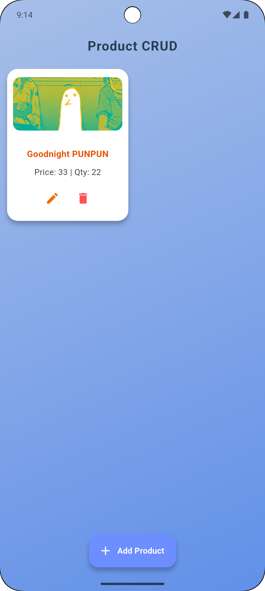
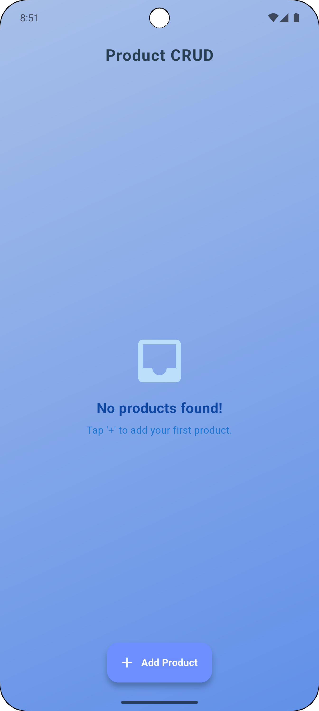
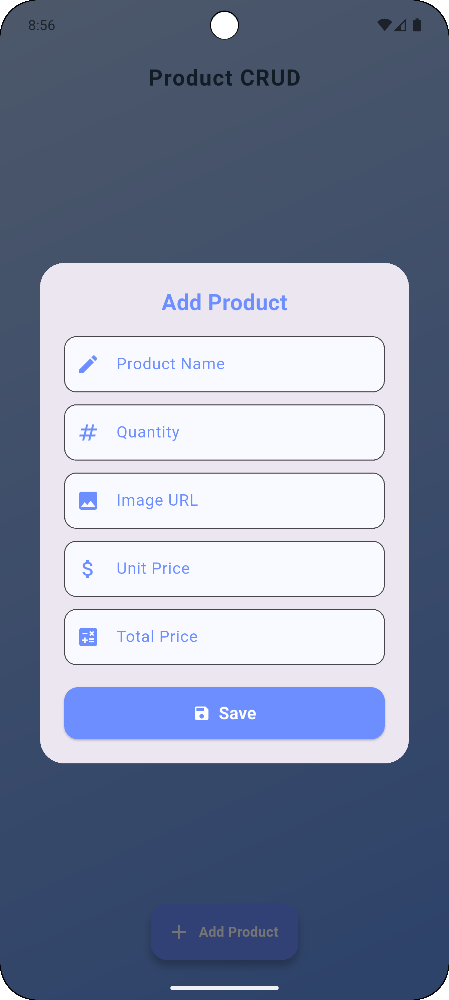

# 📱 Product CRUD App

> A beautiful and feature-rich Product Management application built with Flutter & REST API integration

[](https://flutter.dev)
[](https://dart.dev)
[](https://restfulapi.net)

## ✨ Features

🔹 **Complete CRUD Operations** - Create, Read, Update, Delete products seamlessly  
🔹 **REST API Integration** - Robust backend connectivity  
🔹 **Beautiful UI/UX** - Modern gradient design with smooth animations  
🔹 **Product Management** - Comprehensive product details including name, quantity, price, and images  
🔹 **Smart Validation** - Form validation with user-friendly error handling  
🔹 **Snackbar Notifications** - Instant feedback for all user actions  
🔹 **Empty State Handling** - Elegant empty state with call-to-action  
🔹 **Responsive Design** - Optimized for different screen sizes

## 📸 Screenshots

<div align="center">
  
  
  
</div>

## 🏗️ Project Structure

```
lib/
├── 📁 Controllers/
│   └── 🎯 ProductController.dart
├── 📁 Models/
│   └── 📦 product_model.dart
├── 📁 pages/
│   └── 🏠 home_page.dart
├── 📁 utils/
│   └── 🔗 urls.dart
├── 📁 widgets/
│   ├── 🃏 product_card.dart
│   └── 💬 product_dialog.dart
└── 🚀 main.dart
```

## 🚀 Getting Started

### Prerequisites

Make sure you have the following installed:
- ✅ Flutter SDK (latest stable version)
- ✅ Dart SDK
- ✅ Android Studio / VS Code
- ✅ Android Emulator or Physical Device

### Installation

1. **Clone the repository**
   ```bash
   git clone https://github.com/OnoPUNPUN/crud_app.git
   cd product-crud-app
   ```

2. **Install dependencies**
   ```bash
   flutter pub get
   ```

3. **Configure API endpoints**
   ```dart
   // Update lib/utils/urls.dart with your API base URL
   static const String baseUrl = 'http://35.73.30.144:2008/api/v1';
   ```

4. **Run the application**
   ```bash
   flutter run
   ```

## 🔧 API Integration

The app integrates with REST API endpoints for:

| Method | Endpoint | Description |
|--------|----------|-------------|
| `GET` | `/products` | Fetch all products |
| `POST` | `/products` | Create new product |
| `PUT` | `/products/{id}` | Update existing product |
| `DELETE` | `/products/{id}` | Delete product |

### Product Model Schema

```json
{
   "ProductName": "ef",
   "ProductCode": 256,
   "Img": "dwq",
   "Qty": 45,
   "UnitPrice": 14,
   "TotalPrice": 888
}
```

## 🎨 Key Features Breakdown

### 📋 Product Listing
- Clean card-based layout with product images
- Price and quantity display
- Edit and delete action buttons
- Pull-to-refresh functionality

### ➕ Add/Edit Products
- Form-based input with validation
- Real-time price calculation
- Image URL support
- Smooth dialog animations

### 🗑️ Delete Operations
- Confirmation dialogs for safe deletion
- Optimistic UI updates
- Rollback on API failure

### 📱 User Experience
- Loading states and shimmer effects
- Success/error snackbar notifications
- Empty state with helpful messaging
- Responsive design patterns

## 🛠️ Built With

- **Flutter** - UI toolkit for crafting beautiful apps
- **Dart** - Programming language optimized for apps
- **HTTP** - For REST API communication
- **Provider/Bloc** - State management (specify which you used)

## 📦 Dependencies

```yaml
dependencies:
  flutter:
    sdk: flutter
  http: ^0.13.5
  # Add other dependencies you're using
```

## 🤝 Contributing

Contributions are welcome! Please feel free to submit a Pull Request.

1. Fork the project
2. Create your feature branch (`git checkout -b feature/AmazingFeature`)
3. Commit your changes (`git commit -m 'Add some AmazingFeature'`)
4. Push to the branch (`git push origin feature/AmazingFeature`)
5. Open a Pull Request

## 📄 License

This project is licensed under the MIT License - see the [LICENSE](LICENSE) file for details.

## 👨‍💻 Developer

**Your Name**
- GitHub: [@OnoPUNPUN](https://github.com/OnoPUNPUN)
- LinkedIn: [crud_app](https://github.com/OnoPUNPUN/crud_app.git)
- Email: tonmoywasimul04@gmail.com

## 🙏 Acknowledgments

- Flutter team for the amazing framework
- Material Design for UI inspiration
- REST API best practices community

---

<div align="center">
  <sub>Built with ❤️ using Flutter</sub>
</div>

---

### 🌟 Show your support

Give a ⭐️ if this project helped you!

[](https://github.com/yourusername/product-crud-app)
[](https://github.com/yourusername/product-crud-app/fork)